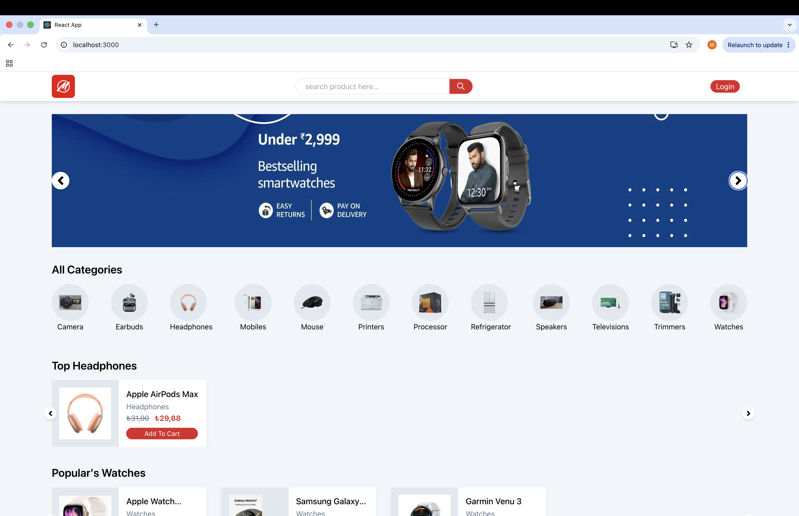
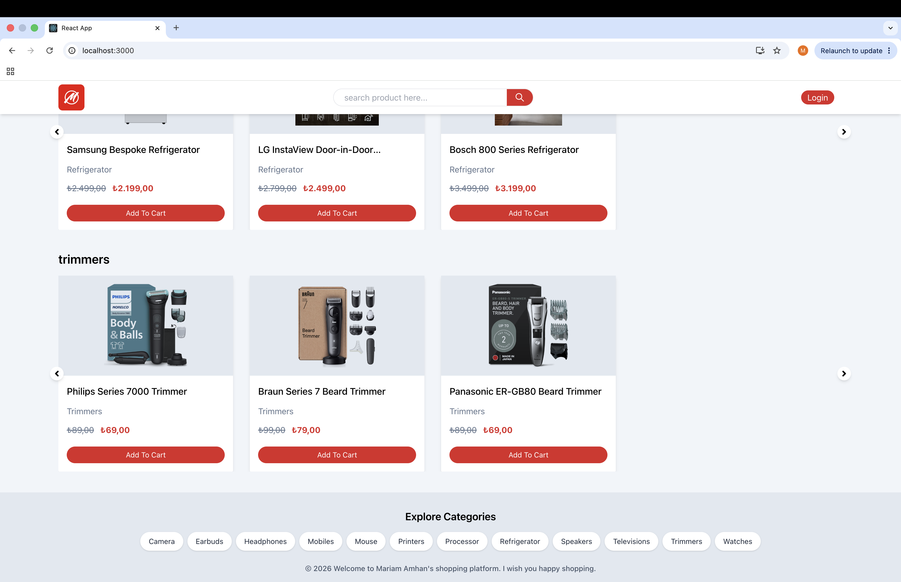
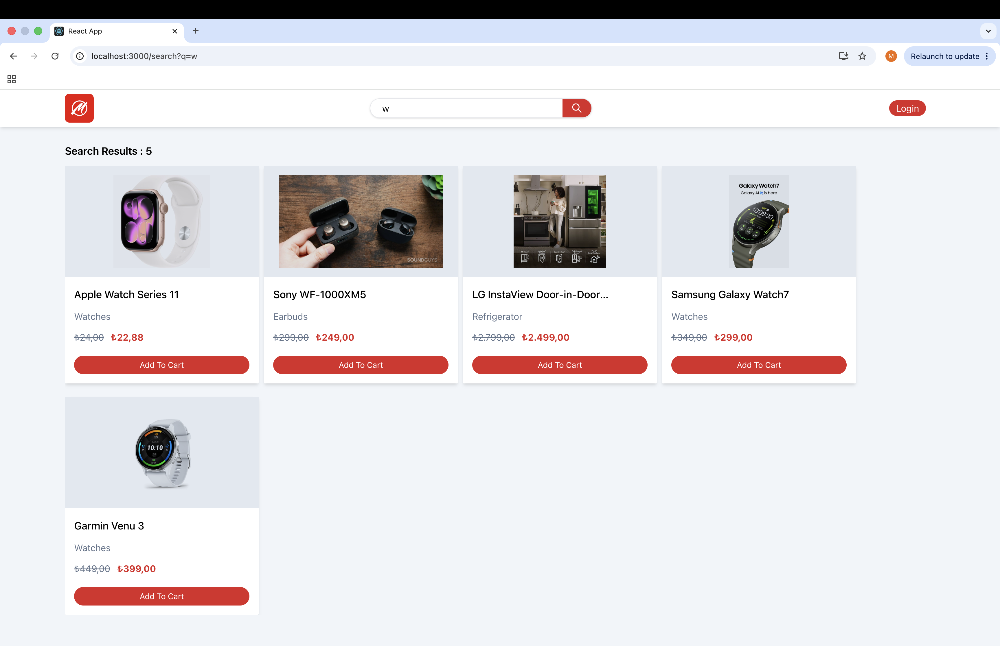

# E-Commerce MERN App

A full-stack e-commerce web application built using the MERN stack (MongoDB, Express.js, React.js, and Node.js).

The application provides a complete shopping experience for users, including product browsing, search and filtering, shopping cart management, authentication, user profiles, and order tracking. It also includes an admin panel for managing users, products, and orders.

## Features

### User Features

- User signup and login
- Email verification
- Google authentication
- Forgot and reset password
- User profile management
- Browse products
- Browse products by category
- Search and filter products
- View product details
- Add products to the shopping cart
- Update product quantities in the cart
- Remove products from the cart
- Place orders
- View personal orders
- Logout

### Admin Features

- Admin panel
- View all users
- Manage user roles
- Delete users
- View all products
- Add new products
- Edit product details
- Delete products
- View all orders
- Manage orders

## Tech Stack

### Frontend

- React.js
- React Router
- Redux
- Tailwind CSS

### Backend

- Node.js
- Express.js
- MongoDB
- Mongoose
- JWT Authentication
- bcrypt.js

## How It Works

The application follows a full-stack client-server architecture:

1. The React frontend provides the user interface and communicates with the backend through API requests.
2. The Node.js and Express.js backend handles application logic, authentication, products, users, carts, and orders.
3. MongoDB is used to store application data.
4. JWT is used for authentication and protected functionality.
5. Role-based access separates general users from administrators.
6. Admin users can access management features for users, products, and orders.

## Project Structure

```text
ecommerce-mern-app/
├── backend/
│   ├── config/
│   ├── controller/
│   │   ├── order/
│   │   ├── product/
│   │   └── user/
│   ├── helpers/
│   ├── middleware/
│   ├── models/
│   ├── routes/
│   ├── utils/
│   └── index.js
│
└── frontend/
    ├── public/
    └── src/
        ├── assets/
        ├── common/
        ├── components/
        ├── context/
        ├── helpers/
        ├── pages/
        ├── routes/
        └── store/
```

## Installation and Setup

### 1. Clone the Repository

```bash
git clone https://github.com/Mariam-amhan/ecommerce-mern-app.git
cd ecommerce-mern-app
```

### 2. Install Backend Dependencies

```bash
cd backend
npm install
```

### 3. Configure Environment Variables

Create a `.env` file inside the `backend` directory and configure the required environment variables.

Example:

```env
MONGODB_URI=your_mongodb_connection_string
JWT_SECRET=your_jwt_secret
FRONTEND_URL=http://localhost:3000
EMAIL_USER=your_email
EMAIL_PASS=your_email_password
PORT=8080
```

Keep your `.env` file private and never commit credentials or secret keys to GitHub.

### 4. Start the Backend

```bash
node index.js
```

The backend runs on:

```text
http://localhost:8080
```

### 5. Install Frontend Dependencies

Open another terminal:

```bash
cd frontend
npm install
```

### 6. Start the Frontend

```bash
npm start
```

Open the application at:

```text
http://localhost:3000
```

## Authentication & Authorization

The application supports authentication and role-based authorization.

Users can create accounts, verify their email addresses, log in, manage their profiles, use the shopping cart, and place orders.

Administrators have additional access to the admin panel where they can manage users, products, and orders.

## Screenshots

### Home Page
The home page displays featured products, promotional banners, and product categories, allowing users to quickly browse and discover available products.




### Home Page – Product Sections & Footer
Additional product sections are displayed by category, with quick access to product details and the shopping cart. The footer also provides shortcuts to the available product categories.




### Product Search
Users can search for products using the search bar. The search results dynamically display products that match the entered search term, even when only part of a product name is entered.




### Product Categories & Filters
Users can select one or multiple product categories to filter the displayed products. Results can also be sorted by price from low to high or high to low.


### User Login
Registered users can sign in using their email and password. The login page also provides password recovery, Google sign-in, and access to account registration.


### User Navigation Panel
After a successful user login, the account menu provides access to Profile, My Orders, and Log Out. The shopping cart icon also displays the number of products currently added to the cart.


### My Orders
Users can view their order history with information such as order ID, date, delivery details, purchased products, quantities, prices, and current order status.


### Shopping Cart
The shopping cart allows users to review selected products, adjust quantities, remove items, and view the total price. Users can also enter their delivery information before placing an order.


### Admin Login
Administrators sign in through the authentication system using their admin account credentials. The application identifies the account role and provides access to administrator-specific features.


### Admin Navigation Panel
After an administrator logs in, an additional Admin Panel option becomes available alongside Profile, My Orders, and Log Out, providing access to the application's management features.


### Admin – Product Management
The admin panel provides an overview of all products. Administrators can add new products, edit existing product information, or remove products from the store.


### Admin – User Management
Administrators can view registered users and their account information, including roles and verification status. User roles can be managed by switching accounts between GENERAL and ADMIN roles.


## Future Improvements

- Add online payment integration
- Improve responsive design and UI/UX
- Add additional order management functionality
- Add product reviews and ratings
- Add wishlist functionality


